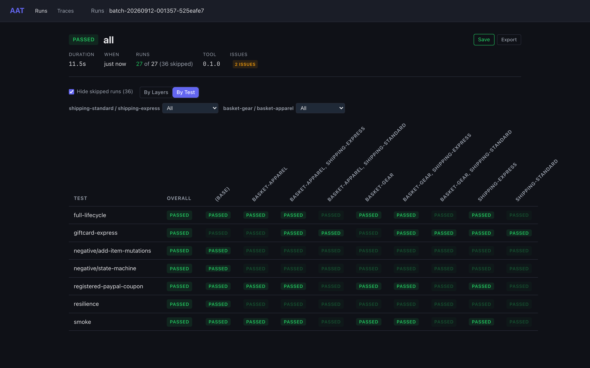

# Matrix Testing with Layer Groups

When you have N plans and M data variations, the naive approach is writing N&times;M plan files. Layer groups eliminate that — you define variations as [layers](plans.md#layers) and let AAT compute the cartesian product at batch time. Better still, AAT automatically detects and skips redundant runs when a layer has no effect on a particular plan.

## Why Matrix Testing

Consider an e-commerce API with a checkout flow. You want to test it across three regions (US, EU, APAC) and two payment methods (credit card, PayPal). That's six combinations. With five plans, you'd need thirty plan files — and every time the checkout flow changes, you update all thirty.

With layer groups:

- **5 plans** define the test logic
- **5 layer files** define the variations (3 regions + 2 payment methods)
- AAT generates **5 &times; 12 = 60 runs** at batch time: the 30 combinations, plus the runs with no region, no payment method, or neither

Add a third dimension (say, currency) and the layer group approach scales linearly while the per-file approach explodes combinatorially.

And when a plan hard-codes a specific region or a recipe already embeds one of the payment layers, AAT's duplicate detection automatically skips the redundant permutations — no manual coordination needed.

## How the Matrix Works

The batch matrix is built from three inputs:

| Input | Source | Purpose |
|-------|--------|---------|
| Plans | Discovered from plan directories | The test logic to execute |
| Base layers | `--layer` flags | Applied to every run unconditionally |
| Layer groups | `--layer-group` flags | Combined into a cartesian product of permutations |

### The formula

```
total runs = plans × permutations
permutations = (group₁ choices + 1) × (group₂ choices + 1) × ...
```

Each group implicitly includes a "none" option — the base case where nothing from that group is selected. The `+1` accounts for this.

### Example

Given two layer groups:

```
--layer-group "us,eu,apac" --layer-group "credit-card,paypal"
```

AAT generates these permutations:

| # | Region group | Payment group | Label |
|---|-------------|---------------|-------|
| 1 | _(none)_ | _(none)_ | `(base)` |
| 2 | _(none)_ | credit-card | `credit-card` |
| 3 | _(none)_ | paypal | `paypal` |
| 4 | us | _(none)_ | `us` |
| 5 | us | credit-card | `credit-card, us` |
| 6 | us | paypal | `paypal, us` |
| 7 | eu | _(none)_ | `eu` |
| 8 | eu | credit-card | `credit-card, eu` |
| 9 | eu | paypal | `eu, paypal` |
| 10 | apac | _(none)_ | `apac` |
| 11 | apac | credit-card | `apac, credit-card` |
| 12 | apac | paypal | `apac, paypal` |

With 4 plans, that's 4 &times; 12 = 48 total runs before dedup.

Permutation labels are sorted alphabetically, so `credit-card, us` not `us, credit-card`.

### Base layers vs layer groups

- `--layer premium` — applied to every run. Not part of the cartesian product.
- `--layer-group "us,eu"` — creates permutations. Each plan runs with and without each option.

You can combine both: `--layer premium --layer-group "us,eu"` means every run gets `premium`, and each plan additionally runs with `us`, `eu`, or neither.

## Duplicate Detection

This is the key intelligence behind matrix testing. When AAT generates 48 runs, not all of them are necessarily distinct — a plan might hard-code values that make a layer irrelevant, or a recipe might already embed a layer from one of the groups. AAT detects these duplicates automatically.

### How it works

For each run in the matrix, AAT:

1. **Instantiates** the plan with its effective layers (base + permutation), applying layer defaults and graph defaults
2. **Fingerprints** the instantiated plan's execution section (a SHA-256 hash of the YAML-serialized steps, values, and assertions)
3. **Groups** runs by (plan file, fingerprint) — two runs of the same plan with the same fingerprint are duplicates
4. **Scores** each duplicate to pick the canonical representative
5. **Skips** non-canonical duplicates

Only runs of the *same plan file* are compared. Two different plans that happen to produce identical execution are not deduplicated — they represent different test intentions.

### Canonical selection

When multiple permutations of the same plan produce identical execution, AAT picks the one whose permutation label most accurately describes what's actually running. The scoring formula:

```
score = symmetric_difference × 100 + effective_layer_count
```

Where:

- **Symmetric difference** = the layers that differ between the permutation's label and the layers the run actually applies (the permutation's layers plus any a recipe embeds in `selection.layers`). Lower is better — it means the label matches reality.
- **Effective layer count** = tiebreaker; fewer applied layers = simpler = preferred.

The run with the lowest score is canonical; the rest are skipped.

### Scenario: Hard-coded plan

A plan `quick-test.yaml` hard-codes all its values explicitly — no inputs come from graph defaults or layers:

```yaml
execution:
  steps:
    - id: create-order
      node: CreateOrder
      values:
        region: "US"
        currency: "USD"
```

When this plan runs against permutations `(base)`, `us`, `eu`, `apac`, all four produce the same fingerprint because the layer overrides have nothing to override — the plan already specifies everything.

AAT picks `(base)` as canonical (score = 0 &times; 100 + 0 = 0) and skips the `us`, `eu`, and `apac` permutations. For a plan that is not a recipe, the applied layers are exactly the permutation's layers, so the symmetric difference is 0 and the tiebreaker decides: the `us` permutation scores 0 &times; 100 + 1 = 1, and so do `eu` and `apac`.

### Scenario: Irrelevant layer

A plan `inventory-check.yaml` tests product search and stock levels — it never touches payment processing:

```yaml
kind: recipe
selection:
  workflow: inventory-flow
overrides:
  values:
    SearchProducts.category: "electronics"
```

The layer group `--layer-group "credit-card,paypal"` provides overrides for `ProcessPayment.method` and `ProcessPayment.provider`. But this plan has no `ProcessPayment` step, so those layer inputs have nothing to target. The `credit-card`, `paypal`, and `(base)` permutations all produce the same fingerprint.

AAT picks `(base)` as canonical and skips the payment permutations. The layer isn't wrong — it just doesn't apply to this plan.

This is the most common dedup scenario in practice. When your layer groups represent a cross-cutting concern (payment methods, auth providers, locale settings), plans that don't touch that concern are automatically collapsed to a single run.

### Scenario: Recipe with embedded layer

A recipe `checkout-eu.yaml` already includes `eu` in its layer list:

```yaml
kind: recipe
selection:
  workflow: checkout-flow
  layers:
    - eu
overrides:
  values:
    CreateOrder.currency: "EUR"
```

When the `eu` layer group produces permutations `(base)`, `us`, `eu`, `apac`:

- `eu` permutation: the recipe already has `eu`, so the CLI `eu` layer is deduplicated during merge. Effective layers = `[eu]`. Fingerprint: X.
- `(base)` permutation: no group layer applied. The recipe's own `eu` layer still applies. Effective layers = `[eu]`. Fingerprint: X.
- Both produce the same fingerprint because the recipe's embedded `eu` layer applies regardless of the permutation.

AAT picks the `eu` permutation as canonical because its label (`eu`) matches the effective layers (`[eu]`) — symmetric difference = 0. The `(base)` permutation has symmetric difference = 1 (effective layer `eu` not declared in permutation).

The `us` and `apac` permutations produce *different* fingerprints (they add a region layer on top of `eu`), so they run normally.

### Scenario: Layer not in any group

A base layer applied via `--layer premium` is not part of any group. It applies to every run uniformly and doesn't participate in dedup logic — it's just part of the effective layers for all runs. Since it's constant across permutations, it doesn't affect fingerprint comparisons.

## Controlling Behavior

### Disabling dedup

```
aat run batch --layer-group "us,eu" --no-dedup
```

Runs every permutation even if duplicates exist. Useful when you want to verify that dedup is correct, or when you have side effects that matter per-run.

Dedup only activates when layer groups are present. Plain `--layer` runs without groups never trigger dedup.

### Shuffling execution order

```
aat run batch --layer-group "us,eu" --shuffle
```

Randomizes the order of execution. Without shuffling, all permutations of the same plan run back-to-back, which concentrates load on the same API paths. Shuffling spreads the load more evenly across services — especially useful with `--parallel`. It also helps detect order-dependent failures. By default, plans run in discovery order crossed with alphabetical permutation order.

### Reproducible shuffling

```
aat run batch --shuffle --seed 42
```

Fixes the random seed for reproducible ordering. When `--seed` is 0 (the default), AAT uses the current time.

### Parallel execution

```
aat run batch --layer-group "us,eu" --parallel 4
```

Runs up to 4 plans concurrently. Combine with `--shuffle` to avoid correlated timing patterns. In parallel mode, AAT replaces the step-by-step output with a live-updating progress display — each active plan gets its own progress bar showing completed steps, the current step ID, and retry status, with a status line tracking overall batch completion. Completed plans scroll up as permanent result lines while active plans continue updating in place.

The [shop example](examples/shop.md)'s seven plans across two layer groups, four at a time:


## Reading the Output

The samples in this section come from the [shop example](examples/shop.md), running its seven plans across two layer groups of two shipping tiers and two baskets.

### Default progress

```
aat run batch --layer-group shipping-standard,shipping-express --layer-group basket-gear,basket-apparel
```

With layer groups, the initial output shows the matrix dimensions, then every duplicate the dedup pass skips:

```
aat: batch run — 7 plans x 9 permutations = 63 total runs

aat: loading environment...
aat: loaded environment "us"
aat: loaded graph (17 nodes)
aat: loaded domain knowledge
aat: loaded 17 templates
aat: loaded 4 layers
aat: loaded 1 OAS spec(s) for runtime validation
aat: dedup — 36 duplicate permutations detected:
  full-lifecycle [basket-apparel, shipping-standard] → duplicate of full-lifecycle [basket-apparel]
  full-lifecycle [basket-gear, shipping-standard] → duplicate of full-lifecycle [basket-gear]
  full-lifecycle [shipping-standard] → duplicate of full-lifecycle [(base)]
  giftcard-express [(base)] → duplicate of giftcard-express [shipping-express]
  ...
```

Each executed run shows its permutation label in brackets, and its steps print as [`aat run plan`](running.md#default-progress) prints them, indented two more spaces:

```
  ── full-lifecycle [(base)] (15 steps) [plan 1/27] ──
    [ 1/15] listProducts         200  0ms
    [ 2/15] checkInventory       200  590ms  retried 1x: response_error
    [ 3/15] createCart           201  0ms
    [ 4/15] addProduct (addItem) 201  0ms
    [ 5/15] addSocks (addItem)   201  0ms
    ...
    [15/15] verify_getOrder      200  0ms
    cleanup:
      deleteOrder            204  0ms
      deleteCart             204  0ms
  ── full-lifecycle [(base)]: PASSED (15 steps, 2.4s) [plan 1/27] ──

  ── full-lifecycle [basket-apparel] (15 steps) [plan 2/27] ──
  ...
```

The run ends with a summary line and the batch archive path:

```
Batch: 27/63 PASSED, 36 SKIPPED (20.7s)
Archive: /path/to/shop/_output/runs/batch-20260911-123631-e0669ad3
```

### Quiet mode

```
aat run batch --layer-group shipping-standard,shipping-express --layer-group basket-gear,basket-apparel --quiet
```

Shows one line per run — executed runs first, then the skipped duplicates — followed by the summary:

```
full-lifecycle [(base)]: PASSED
full-lifecycle [basket-apparel]: PASSED
full-lifecycle [basket-apparel, shipping-express]: PASSED
...
smoke [shipping-express]: PASSED
full-lifecycle [basket-apparel, shipping-standard]: SKIPPED (duplicate of full-lifecycle [basket-apparel])
...
smoke [shipping-standard]: SKIPPED (duplicate of smoke [(base)])
Batch: 27/63 PASSED, 36 SKIPPED
Archive: /path/to/shop/_output/runs/batch-20260911-123658-ba22ca32
```

### JSON mode

```
aat run batch --layer-group shipping-standard,shipping-express --layer-group basket-gear,basket-apparel --json
```

Produces a machine-readable `BatchSummary` to stdout (implies `--quiet`). Each run entry includes `permutation`, `layers`, `skipped`, and `duplicate_of` fields (the `(base)` permutation with no `--layer` flags has no `layers`). A run's `duration_ms` is its wall-clock time, retry waits included; the summary's is the whole batch's. Trimmed to one executed and one skipped run:

```json
{
  "outcome": "passed",
  "batch_id": "batch-20260911-123725-0fe7aa4c",
  "runs": [
    {
      "plan_name": "full-lifecycle",
      "outcome": "passed",
      "step_count": 15,
      "passed_steps": 15,
      "failed_steps": 0,
      "duration_ms": 1819,
      "archive_path": "/path/to/shop/_output/runs/batch-20260911-123725-0fe7aa4c/run-20260911-123725-f460a192/archive.json",
      "permutation": "(base)"
    },
    {
      "plan_name": "full-lifecycle",
      "outcome": "skipped",
      "step_count": 0,
      "passed_steps": 0,
      "failed_steps": 0,
      "duration_ms": 0,
      "layers": [
        "shipping-standard",
        "basket-apparel"
      ],
      "permutation": "basket-apparel, shipping-standard",
      "skipped": true,
      "duplicate_of": "full-lifecycle [basket-apparel]"
    }
  ],
  "summary": {
    "total_plans": 63,
    "passed_plans": 27,
    "failed_plans": 0,
    "error_plans": 0,
    "skipped_plans": 36,
    "duration_ms": 19246
  },
  "archive_path": "/path/to/shop/_output/runs/batch-20260911-123725-0fe7aa4c"
}
```

`batch.json` in the batch archive records the same runs with camelCase keys (`planName`, `duplicateOf`).

### Batch archives

Batch runs produce an archive directory with `batch.json` and per-run subdirectories:

```
runs/
  batch-20260301-143022-a1b2c3d4/
    batch.json                          # aggregate results
    run-20260301-143022-e5f6a7b8/       # checkout [(base)]
      archive.json
    run-20260301-143023-c9d0e1f2/       # checkout [credit-card, us]
      archive.json
    ...
```

Skipped runs appear in `batch.json` but have no run directory — there's nothing to archive since they weren't executed.

See [Archives](archives.md) for what an archive contains and [Web UI](web-ui.md) for inspecting archives in the browser.

### Reading the matrix in the web UI

`aat web` renders the same batch as a permutation matrix. Open the batch (from the run list, or `aat web view batch-...`) and use the **By Layers** / **By Test** toggle at the top of the batch detail page:



- **By Layers** groups runs by permutation — one block per layer combination — which is the quickest way to see whether a whole configuration is broken.
- **By Test** pivots to one row per plan and one column per permutation, with an **Overall** column, so a single test can be scanned across every configuration. The per-dimension drop-downs above the table pin any layer group to **All**, **(none)**, or one value, and the counter shows how many permutations remain.

Skipped duplicates appear greyed out with a pointer to the run they duplicate; the **hide skipped** toggle collapses them. See [Web UI: Batch Detail](web-ui.md#batch-detail) for the full description of both views.

## Putting It Together

Here's a complete example for an e-commerce API test suite.

### Layer files

```yaml
# layers/us.yaml
name: us
description: US region defaults
inputs:
  region: "US"
  currency: "USD"
  locale: "en-US"
```

```yaml
# layers/eu.yaml
name: eu
description: EU region defaults
inputs:
  region: "EU"
  currency: "EUR"
  locale: "en-GB"
```

```yaml
# layers/credit-card.yaml
name: credit-card
description: Credit card payment method
inputs:
  ProcessPayment.method: "credit_card"
  ProcessPayment.provider: "card-gateway"
```

```yaml
# layers/paypal.yaml
name: paypal
description: PayPal payment method
inputs:
  ProcessPayment.method: "paypal"
  ProcessPayment.provider: "paypal"
```

### Plans

A plan's name is its file name under the plans directory, so `plans/checkout.yaml` runs as `checkout`. A recipe that relies on layers for region/payment data:

```yaml
# plans/checkout.yaml
kind: recipe
selection:
  workflow: checkout-flow
```

A recipe that embeds a specific region:

```yaml
# plans/checkout-eu.yaml
kind: recipe
selection:
  workflow: checkout-flow
  layers:
    - eu
```

A plan that doesn't touch payments — the payment layer group is irrelevant:

```yaml
# plans/inventory-check.yaml
kind: recipe
selection:
  workflow: inventory-flow
overrides:
  values:
    SearchProducts.category: "electronics"
```

A fully explicit plan that ignores all layers:

```yaml
# plans/quick-test.yaml
execution:
  steps:
    - id: create-order
      node: CreateOrder
      values:
        region: "US"
        amount: 99.99
```

### Running the matrix

```bash
aat run batch \
  --layer-group "us,eu" \
  --layer-group "credit-card,paypal" \
  --parallel 4
```

Two groups of two values each produce (2+1) &times; (2+1) = **9 permutations** (each group includes a "none" option). With 4 plans:

- **4 plans** &times; **9 permutations** = **36 matrix entries**
- `quick-test` hard-codes everything → all layers are irrelevant → **8 skipped** (only `(base)` runs)
- `inventory-check` has no payment step → payment layers have no effect within each region variant → **6 skipped**
- `checkout-eu` embeds `eu` → the `eu` permutation duplicates `(base)`, same for payment+eu variants → **3 skipped**
- `checkout` uses both region and payment defaults → all 9 permutations are distinct → **0 skipped**
- **19 actual runs**, 17 skipped

```
aat: batch run — 4 plans x 9 permutations = 36 total runs (parallel=4)

aat: dedup — 17 duplicate permutations detected:
  checkout-eu [(base)] → duplicate of checkout-eu [eu]
  checkout-eu [credit-card] → duplicate of checkout-eu [credit-card, eu]
  checkout-eu [paypal] → duplicate of checkout-eu [eu, paypal]
  inventory-check [credit-card] → duplicate of inventory-check [(base)]
  inventory-check [credit-card, eu] → duplicate of inventory-check [eu]
  inventory-check [credit-card, us] → duplicate of inventory-check [us]
  inventory-check [eu, paypal] → duplicate of inventory-check [eu]
  inventory-check [paypal] → duplicate of inventory-check [(base)]
  inventory-check [paypal, us] → duplicate of inventory-check [us]
  quick-test [credit-card] → duplicate of quick-test [(base)]
  quick-test [credit-card, eu] → duplicate of quick-test [(base)]
  quick-test [credit-card, us] → duplicate of quick-test [(base)]
  quick-test [eu] → duplicate of quick-test [(base)]
  quick-test [eu, paypal] → duplicate of quick-test [(base)]
  quick-test [paypal] → duplicate of quick-test [(base)]
  quick-test [paypal, us] → duplicate of quick-test [(base)]
  quick-test [us] → duplicate of quick-test [(base)]

Batch: 19/36 PASSED, 17 SKIPPED (12.4s)
Archive: runs/batch-20260301-143022-a1b2c3d4
```
