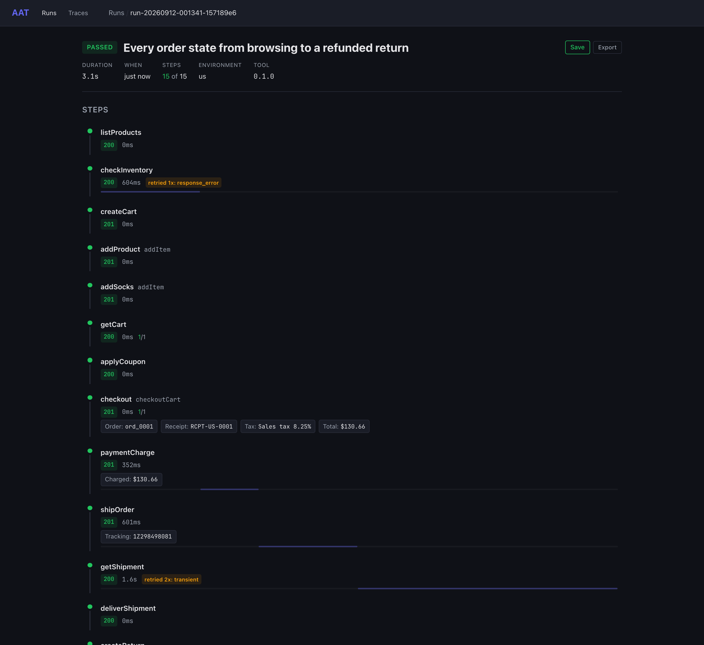
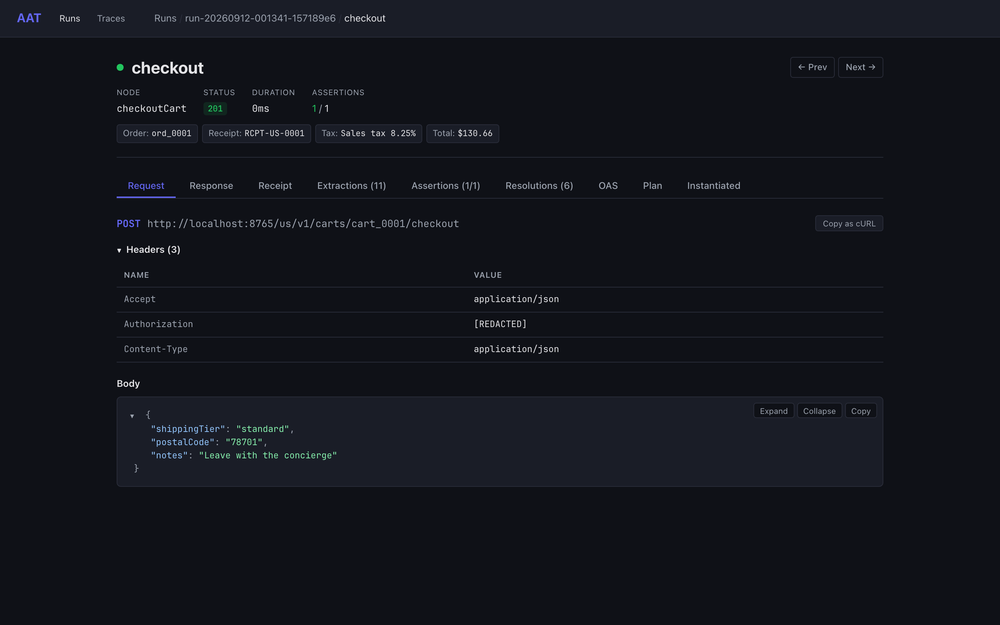

# Web UI

`aat web` serves a browser interface over your run [archives](archives.md): lists of runs and batches, a step timeline for each run, every request and response, how each input got its value, the permutation matrix of a layered batch, and the planning traces of `aat prompt`.

The web UI is compiled into release builds and into `make build` binaries. A `go install` build, or a `make cli` build from a fresh clone, has no web UI: `aat web` exits with code `2` and a hint. See [Install](install.md).

## Starting the Web UI

```
aat web
```

Starts a server on `http://localhost:9119` for the project's archive directory and runs until you press Ctrl+C.

| Flag | Type | Default | Description |
|------|------|---------|-------------|
| `--host` | string | `127.0.0.1` | Interface to bind; `0.0.0.0` accepts connections from other machines or containers. The `AAT_HOST` environment variable sets it when the flag is absent |
| `--port` | int | `9119` | Listen port |
| `--open` | bool | `false` | Open the browser after starting |
| `--dev` | bool | `false` | Development mode (request logging, frontend proxied to Vite) |
| `--manifest` | path | auto-discovered | Explicit path to `aat-project.yaml` |
| `--output` | path | manifest `archives`, else `_output/runs` | Archive directory to serve |

The server listens on loopback by default, so only this machine can reach it. It has no authentication: anyone who can reach the port can read every archive, rename runs, and import files. `--host 0.0.0.0` makes all of that reachable from your network, so use it only where that is acceptable (see [SECURITY.md](https://github.com/gburgyan/aat/blob/main/SECURITY.md)). The Docker image sets `AAT_HOST=0.0.0.0`, because inside a container loopback cannot be reached through a published port; see [Install: Docker](install.md#docker).

`aat web --dev` does not need the compiled bundle, because it proxies the frontend to the Vite dev server (see [Development Mode](#development-mode)).

## Viewing Runs

```
aat web view [ref]
```

Opens a run, a batch, or the run list in the browser. If a server is already running on the port, AAT opens the page there. If not, it starts a temporary server that runs until you press Ctrl+C.

```
# Open the run list
aat web view

# Open the newest run or batch
aat web view latest

# Open a specific run
aat web view run-20260910-225958-d819f460

# Open a batch
aat web view batch-20260910-225919-0754c0ea
```

A reference is a directory name in the archive directory, including a saved name; AAT treats it as a batch when the directory holds `batch.json`. `aat web view` takes the same `--host`, `--port`, `--manifest`, and `--output` flags as `aat web`.

### Viewing a File

`ref` can also be a file: an exported `.aar` or `.aab`, or a bare `archive.json` or `batch.json` from a CI artifact. AAT loads it into memory, with no project needed, and serves it read-only:

```
aat web view exported-run.aar
```

Viewing a file always starts its own server, so it fails while `aat web` holds the port; pass another `--port`. See [Archives: Viewing a File](archives.md#viewing-a-file).

## Viewing Traces

```
aat web viewtrace [id]
```

Opens the trace viewer for a specific planning trace, or lists all traces if no ID is given. Traces are produced by `aat prompt --trace`.

```
# Open a specific trace
aat web viewtrace trace-20260223-141000-f1g2h3i4

# Browse all traces
aat web viewtrace
```

See [LLM-Assisted Planning: Debugging with Traces](prompt.md#debugging-with-traces) for what traces contain.

## Web UI Features

### Run and Batch List

The landing page lists runs and batches, newest first. Each row shows the outcome, the name (a saved name, else the plan name or batch source, else the ID), step counts, duration, and when it ran, with badges for attempts, layers, and issues. The **All** / **Saved** filter narrows the list to [named runs](archives.md#naming-and-saving-runs), the download arrow on each row exports it, and the **Import** button accepts `.aar`/`.aab` files (see [Archives: Exporting and Importing](archives.md#exporting-and-importing)).

Entries with recorded issues carry an **N issues** badge; hover it to see the count broken down by category. Issues are counted per category in the archive summary (`issues` in `summary.json` and in `--json` output). Today the only category is `oas`, the number of OpenAPI request and response violations found by [OAS validation](running.md#oas-validation). Batch detail shows the same badge for the batch as a whole and for each member run.

### Run Detail

Clicking a run opens the detail view:

- **Header**: outcome, plan name, **Save**/**Export** controls, a link to the batch the run belongs to, and the run's error
- **Metadata**: duration, when it ran, step counts, environment, AAT version, and layers applied
- **Step timeline**: each step's ID (with its node when the two differ), status, duration, assertion count, retry and OAS badges, display outputs, and a duration bar placed on the run's time span, so slow steps and ordering stand out; cleanup steps follow in their own section. A step that retried carries a badge naming why, as run output does (`retried 2x: transient`), and its bar covers every attempt
- **Prior attempts**: for a run retried with `--retries`, a table of the failed attempts, each opening that attempt's archive



### Step Detail

Clicking a step opens the step detail. Tabs appear only when the step has that data:

| Tab | Contents |
|-----|----------|
| Request | HTTP method, URL, headers, request body (formatted JSON), and a **Copy as cURL** button |
| Response | Status code, response headers, response body (formatted JSON with expand/collapse) |
| Extractions | Each output's value and the later steps that consumed it |
| Lua Output | The step's outputs after its [Lua transform](lua-transforms.md) ran |
| Assertions | Per-assertion results: pass or fail, type, message, path, and expression |
| Resolutions | How each input got its value: source, value, the step output it came from, whether its constraint passed, and details |
| Selections | Array element selection: source array size, filter, strategy, selected index |
| OAS | Request and response validation against the OpenAPI spec |
| Errors | Error classification, expected-failure result, and errors detected in a 2xx response body |
| Plan, Instantiated | The step as written in the plan, and after graph defaults and layers were merged in |

**Copy as cURL** builds a `curl -X <method> '<url>' -H ... --data '...'` command from the request exactly as the archive recorded it and copies it to the clipboard, so a failing call can be replayed from a terminal or pasted into a bug report. Because archives redact auth headers and known secrets, an `Authorization` header or an API key comes through as `[REDACTED]`; substitute a live value before running it. Data the API returned, such as personal data, is copied as recorded, so check the command before pasting it anywhere public (see [Archives: What Is Redacted, and What Is Not](archives.md#what-is-redacted-and-what-is-not)). If the step was routed by an override, the URL is the one actually called, marked **OVERRIDE**, with the original shown beneath it.



### Visualizer Tabs

When [visualizer plugins](visualizers.md) are configured, matching steps show additional tabs in the step detail view. Each tab renders the response data through a custom HTML visualizer in a sandboxed iframe. Visualizers are matched by response body content or node name; see the [visualizers documentation](visualizers.md) for how matching works.

### Batch Detail

Batch detail shows an aggregate view with outcome counts, total duration, an issues badge, and the per-plan results. Click any plan to drill down to its individual run detail.

When the batch was run with `--layer-group`, a **By Layers** / **By Test** toggle switches between two layouts of the same permutation matrix (the choice is remembered per browser):

- **By Layers** groups runs by permutation: one section per layer combination, listing each plan's outcome, duration, and any extra `--layer` values applied on top.
- **By Test** pivots the data into a table with one row per plan and one column per permutation, plus an **Overall** column, so you can scan a single test across every configuration. Above the table, one drop-down per layer group filters the columns: **All**, **(none)** (permutations where that dimension is unset), or a specific layer value. A **Clear filters** button and a `N of M permutations` counter appear whenever a filter is active.

Duplicate permutations skipped by [dedup](batch-layers.md#duplicate-detection) are shown as skipped with a pointer to the canonical run; a **hide skipped** toggle removes them from both views. See [Matrix Testing: Reading the matrix in the web UI](batch-layers.md#reading-the-matrix-in-the-web-ui).

### Trace Viewer

The trace viewer shows the `aat prompt` planning pipeline step by step:

- Workflow selection call: prompts sent, raw response, token counts, timing
- Skeleton composition: the composed plan scaffold
- Value fill call: prompts, response, tokens, timing
- Post-processing snapshots
- Validation results or errors

## Debugging Patterns

### Failed Steps

Start with the **Response** tab to see the status code and response body. Common patterns:

- `400`: bad request; check the **Request** tab for malformed input
- `401`/`403`: authentication issue; check your environment config, and rerun with `--verbose-auth` (see [Running Tests: Debugging Authentication](running.md#debugging-authentication))
- `404`: resource not found; check the **Resolutions** tab for incorrect references
- `500`: server error; the response body usually contains diagnostic details

### Value Resolution Issues

Open the **Resolutions** tab to see how each input was resolved:

- **Source**: where the value came from, such as `plan_default` (a literal value in the plan), `expression`, `plan_from` (an earlier step's output), `select_edge` or `named_selection` (an element picked from an array), `fallback_pool` (a `pool` in the plan or a graph default), or `graph_default`
- **Value**: the raw and final value
- **Constraint**: whether the value satisfied its `constraint`, and which pool values were tried

If a value looks wrong, trace it back through its source. A `from` reference points to an earlier step's output; check that step's **Extractions** tab to see what was actually extracted and which steps consumed it.

### Selection Problems

The **Selections** tab shows:

- **Source array size**: how many elements were available
- **Filter**: what predicate was applied (and how many elements passed)
- **Strategy**: which selection strategy was used (`first`, `last`, `index`, `random`, `min`, `max`, or `match`)
- **Selected index**: which element was picked

Common issues: an empty source array (the search returned no results), a filter that eliminates all elements, or a sort field that doesn't differentiate elements well.

### Assertion Failures

The **Assertions** tab shows each assertion with its result message, which states what was expected and what was found, along with the path or expression it checked.

## API Routes

The web server exposes a REST API that you can use programmatically.

| Method | Route | Description |
|--------|-------|-------------|
| `GET` | `/health` | Health check |
| `GET` | `/api/runs` | List runs (`?limit=`, default 50; `?saved=true` for named runs only) |
| `GET` | `/api/runs/latest` | Redirect to the newest run or batch |
| `GET` | `/api/runs/{id}` | Get run detail |
| `PUT` | `/api/runs/{id}/name` | Rename or save a run |
| `DELETE` | `/api/runs/{id}/name` | Restore the original run ID |
| `GET` | `/api/runs/{id}/steps/{stepId}` | Get step detail |
| `GET` | `/api/runs/{id}/attempts/{attempt}` | Get a retry attempt |
| `GET` | `/api/runs/{id}/attempts/{attempt}/steps/{stepId}` | Get step from a specific attempt |
| `GET` | `/api/runs/{id}/export` | Download the run as a `.aar` zip |
| `GET` | `/api/batches` | List batches (same query parameters as runs) |
| `GET` | `/api/batches/{id}` | Get batch detail |
| `PUT` | `/api/batches/{id}/name` | Rename or save a batch |
| `DELETE` | `/api/batches/{id}/name` | Restore the original batch ID |
| `GET` | `/api/batches/{id}/export` | Download the batch as a `.aab` zip |
| `POST` | `/api/import` | Import a `.aar`/`.aab` (multipart `file` field, 100 MB max) |
| `GET` | `/api/traces` | List plan traces |
| `GET` | `/api/traces/{id}` | Get trace detail |
| `GET` | `/api/visualizers/{id}` | Get visualizer HTML file |

The naming, export, and import routes are described in [Archives](archives.md). A run, batch, or trace `{id}` must be a single directory name: any other ID answers `404`, and a rename moves only run and batch directories.

## Development Mode

For frontend development, run the Vite dev server alongside AAT's Go server:

```bash
# Terminal 1: Vite dev server with hot reload
cd server/web && npm run dev

# Terminal 2: Go server proxying to Vite
aat web --dev
```

In `--dev` mode, the Go server proxies frontend requests to Vite on port 5173 and enables request logging. The API routes (`/api/*`) are served directly by the Go server. This gives you hot reload for frontend changes while using the real API backend.

For production, `make build` compiles the Svelte frontend and embeds it into the Go binary via `//go:embed`. Release binaries are built this way.

---

*Source: `cmd/aat/web_cmd.go`, `server/server.go`, `server/handlers.go`, `server/service.go`, `server/embed.go`, `server/web/src/routes/*.svelte`, `server/web/src/components/*.svelte`.*
