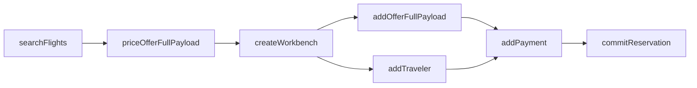

<!-- _class: lead -->

# AAT
## Adaptive API Testing

**AI-Driven Orchestrated Workflow Validation**


<!--
TIMING: 30 seconds
- "Good morning/afternoon everyone"
- "Today I'm going to show you AAT — a tool that rethinks how we test complex APIs"
- "This is a working system, not a pitch deck — we'll do live demos"
-->

---

# The Problem

Complex APIs require **orchestration**, not just invocation.

```
Search Flights → Price Offer → Create Workbench → Add Offer
    → Add Traveler → Add Payment → Commit Reservation
        → [Cleanup: Release Workbench]
```

- Each step depends on **outputs from previous steps**
- IDs, tokens, and references flow between calls
- A single booking requires **8+ coordinated API calls**
- Failure at any point requires **cleanup of partial state**

<!--
TIMING: 1.5 minutes
- "Let's start with the problem. Modern APIs aren't single endpoints."
- "Here's a real Travelport booking flow — 8 API calls, each depending on the last"
- "The search returns offerings. You pick one, price it, create a workbench — which is like a shopping cart — add the offer, add a traveler, add payment, and finally commit."
- "If step 6 fails, you still need to clean up the workbench from step 3."
- "And this is the SIMPLE case. A round-trip with seat selection and ancillaries is 15+ calls."
-->

---

# Why Existing Tools Fall Short

| Approach | Problem |
|----------|---------|
| **Scripted automation** (Postman, pytest) | Test logic is tangled with API details. Change one endpoint, fix 50 scripts. |
| **Manual testing** | Doesn't scale. Knowledge lives in people's heads. |
| **AI-generated scripts** | Produces the same brittle code, just faster. |

All three **conflate test intent with execution details**.

> *"American Airlines goes down, all your booking tests fail — but AA was never the point of the test."*

<!--
TIMING: 1.5 minutes
- "So how do people test these today?"
- "Scripted automation: Postman collections, pytest scripts. They work, but the test logic is welded to the API details."
- "You change one field name and 50 scripts break."
- "AI code gen just makes the same brittle scripts faster."
- "The real insight: When AA goes down and your tests fail, you don't have a test failure — you have a test infrastructure problem. The TEST was 'can I book a flight', not 'can I book on AA'."
-->

---

# The AAT Solution — Three Layers

<div class="columns">
<div>

### Layer 1: API Graph
The reusable map of your API landscape.
Nodes, edges, data flow, workflows.
*Write once, use everywhere.*

### Layer 2: Test Intent
What you want to test + constraints.
"Book a flight, prefer UA, depart in 2 weeks"
*Separated from HOW.*

### Layer 3: Execution Plan
Resolved steps, selections, data wiring.
Saveable. Re-runnable. Diffable.
*Deterministic execution.*

</div>
<div>

```
  ┌──────────────────┐
  │    Test Intent    │  "Book a flight"
  │  (goal + prefs)  │
  └────────┬─────────┘
           │ LLM or manual
  ┌────────▼─────────┐
  │  Execution Plan   │  8 steps, wired
  │  (YAML artifact)  │
  └────────┬─────────┘
           │ engine
  ┌────────▼─────────┐
  │    API Graph      │  56 nodes,
  │  + Templates      │  111 edges
  └──────────────────┘
```

</div>
</div>

<!--
TIMING: 1.5 minutes
- "AAT solves this with three layers that are explicitly separated."
- "At the bottom: an API Graph. This is a YAML model of your entire API surface. 56 nodes, 111 edges for Travelport. You write it once."
- "At the top: your test intent. Just what you want to test, plus any constraints."
- "In the middle: an execution plan. This is the resolved, concrete test — every step, every selection, every data reference. It's a YAML file you can save, version, and re-run."
- "The key insight: these three things change at different rates and for different reasons. Separating them means each can evolve independently."
-->

---

# Live Demo: The API Graph

**`travelport/graph.yaml`** — 2,175 lines modeling the Travelport Air API

```yaml
nodes:
  searchFlights:
    description: "Search for air catalog product offerings"
    adapter: searchFlights
    tags: [search]
    inputs:
      origin: { type: string, description: "IATA airport code" }
      destination: { type: string }
      departureDate: { type: string }
    outputs:
      catalogProductOfferings:
        type: array
        elementFields:
          - { name: offeringId, path: "id" }
          - { name: carrier, path: "ProductBrandOptions..." }
```

*56 nodes, 111 edges, 21 workflows (15 base + 6 addons)*

<!--
TIMING: 1 minute
DEMO: Open travelport/graph.yaml, scroll through the structure
- "Here's the actual graph file. 2,175 lines of YAML."
- "Each node declares its inputs, outputs, and which adapter template handles the HTTP call."
- "Outputs can be arrays — like search results — with elementFields that define how to extract structured data using gjson paths."
- "56 nodes covering search, pricing, booking, ticketing, exchanges, ancillaries, seats, traveler management..."
- "And 21 workflows — pre-defined paths through the graph."
-->

---

# Live Demo: Templates

**`travelport/templates/searchFlights.yaml`** — HTTP request + response extraction

```yaml
adapter: searchFlights
protocol: http

request:
  method: POST
  path: /11/air/catalog/search/catalogproductofferings
  headers:
    Content-Type: application/json
  body: |
    {
      "@type": "CatalogProductOfferingsQueryRequest",
      "CatalogProductOfferingsRequest": {
        "@type": "CatalogProductOfferingsRequestAir",
        "contentSourceList": ["{{contentSource}}"],
        "PassengerCriteria": [{
          "number": {{passengers}},
          "passengerTypeCode": "{{passengerTypeCode}}"
        }],
        "SearchCriteriaFlight": [{
          "departureDate": "{{departureDate}}",
          "From": { "value": "{{origin}}" },
          "To": { "value": "{{destination}}" }
        }]
      }
    }
```

<!--
TIMING: 1 minute
DEMO: Open travelport/templates/searchFlights.yaml
- "Templates are declarative. This is the search flights template."
- "The request is an HTTP POST with mustache-style placeholders — origin, destination, dates."
- "The response section extracts data using gjson paths — carrier, flight number, departure time."
- "Optional Lua transform scripts handle complex response structures like GDS reference lists."
- "56 templates, one per node. They're pure data — no procedural code."
-->

---

# Live Demo: The Plan

**`travelport/workflows/oneway-fullpayload.yaml`**

```yaml
intent:
  description: "Book a one-way flight using full-payload flow"

execution:
  steps:
    - node: searchFlights
      values:
        origin: DEN
        destination: SFO
        departureDate: "{{today + 14 days}}"

    - node: priceOfferFullPayload
      dependsOn: [searchFlights]
      selections:
        offering:
          from: searchFlights.catalogProductOfferings
          strategy: first
      values:
        carrier: {fromSelection: offering.carrier}

    - node: commitReservation
      dependsOn: [addPayment, createWorkbench]
      isGoal: true
      values:
        workbenchId: {from: createWorkbench.workbenchId}

  cleanup:
    - node: ignoreWorkbench
      runOn: always
```

<!--
TIMING: 1 minute
DEMO: Open travelport/workflows/oneway-fullpayload.yaml
- "Here's a complete booking plan. 8 steps, fully wired."
- "Step 1 searches for flights. The departure date is an expression — today plus 14 days — so it always works."
- "Step 2 prices the first offering from the search results. Note the selection: strategy 'first' from the array."
- "Values flow between steps: carrier comes fromSelection, workbenchId comes from a previous step's output."
- "At the bottom: cleanup. ignoreWorkbench runs ALWAYS — even if the test fails mid-way."
- "This is a YAML file. You can version it, diff it, review it in a PR."
-->

---

# Live Demo: Running a Plan

```bash
aat run \
  --plan travelport/workflows/oneway-fullpayload.yaml \
  --env travelport/env.yaml \
  --graph travelport/graph.yaml \
  --templates travelport/templates/
```

Expected output:
```
aat: executing plan (8 steps, mode=strict)...

  [1/8] searchFlights           200   342ms
  [2/8] priceOfferFullPayload   200   156ms
  [3/8] createWorkbench         200    89ms
  [4/8] addOfferFullPayload     200   234ms
  [5/8] addTraveler             200   123ms
  [6/8] addFormOfPaymentCash    200    78ms
  [7/8] addPayment              200   145ms
  [8/8] commitReservation       200   267ms

  cleanup:
    ignoreWorkbench             200    45ms

PASSED (8/8 steps, 1.479s)
```

<!--
TIMING: 2 minutes
DEMO: Run the actual command live. Have a backup archive ready in case of API issues.
PRE-DEMO: Verify credentials work. Run once before the presentation.
- "Let's run it for real."
- [Run the command]
- "8 API calls, automatic data passing between steps, cleanup at the end."
- "Every step shows status code and timing. The engine resolves inputs, extracts outputs, and passes data forward."
- "It also wrote an archive to the runs/ directory — full request/response pairs for every step, with sensitive headers redacted."
- "Total time: under 2 seconds for a complete booking workflow."
-->

---

# Adaptive Execution

Three modes for different contexts:

| Mode | Behavior | Use Case |
|------|----------|----------|
| **Strict** | Defaults and value pools only. Zero LLM calls. | CI/CD pipelines |
| **Lean** | Try pools first, LLM as last resort. | Development testing |
| **Adaptive** | Lean + soft constraint relaxation on failure. | Exploratory testing |

### The "AA Goes Down" Example

```yaml
values:
  carrier: UA    # ← hard constraint: only United
  carrier: UA    # ← soft constraint: prefer United, but flexible
```

In *adaptive* mode: carrier is "prefer UA" → UA returns 4xx → engine **relaxes** the constraint → tries another carrier → test passes.

**The test was "can I book a flight", not "can I book on United".**

<!--
TIMING: 1.5 minutes
- "The engine has three execution modes."
- "Strict: no AI, no guessing. Uses only the values in the plan and configured value pools. This is what you run in CI."
- "Lean: tries pools first, but if a value can't be resolved, it asks an LLM. Useful during development."
- "Adaptive: the interesting one. If a step fails with a 4xx AND the failing input has a soft constraint, the engine relaxes the constraint and retries."
- "Remember the AA example? If your plan says 'prefer United' and United's API is down, adaptive mode drops the carrier constraint and tries whatever's available."
- "The test passes because the INTENT was to book a flight, not to book on United."
-->

---

# Composable Workflows

Base workflows + addons = no copy/paste.

<div class="columns">
<div>

**Base: Full-Payload Booking**
search → price → workbench → offer → traveler → payment → commit

**+ Seat Selection addon**
Inserts after `priceOfferFullPayload`:
searchSeatMap → addSeatOffer

**+ Ancillary addon**
Inserts after `addTraveler`:
searchAncillaries → addAncillaryOffer

</div>
<div>

```yaml
workflows:
  - name: Full-Payload Booking
    template: workflows/oneway-fullpayload.yaml

  - name: Seat Selection
    kind: addon
    after: priceOfferFullPayload
    template: workflows/seat-selection.yaml
    wire:
      offerListIdentifier:
        priceOfferFullPayload.offerIdentifierValue

  - name: Ancillary Booking
    kind: addon
    after: addTraveler
    template: workflows/ancillary-booking.yaml
```

</div>
</div>

*21 workflows: 15 base + 6 addons. Combine freely.*

<!--
TIMING: 1 minute
- "Workflows are composable. You have base workflows and addons."
- "The base booking flow is 8 steps. Need seat selection? That's a 2-step addon that splices in after pricing."
- "Need ancillaries — bags, meals? Another addon, splices in after the traveler step."
- "The addon declares WHERE it inserts and how it WIRES to the base flow. No copy/paste, no duplicated steps."
- "21 total workflows: 15 base paths, 6 addons. Mix and match."
-->

---

# MCP Server — The Graph as Platform

`aat mcp serve` exposes the graph to AI-powered IDE tools.

<div class="columns">
<div>

### 32 Tools Across 8 Categories

- **Graph**: list_nodes, describe_node, trace_workflow
- **Templates**: inspect_template, list_adapters
- **Domain**: explain_concept, list_value_pools
- **OAS**: get_operation, validate_request, build_example
- **Plans**: generate_plan, validate_plan
- **Workflows**: list_workflows, instantiate_workflow
- **Execution**: execute_plan
- **Archives**: inspect_archive, diff_archives, analyze_failure

</div>
<div>

### One Artifact Powers Everything

```
  ┌─────────────────┐
  │   graph.yaml    │
  │  + templates/   │
  │  + domain.yaml  │
  └───────┬─────────┘
          │
    ┌─────┴─────┐
    │ MCP Server │
    └─────┬─────┘
          │
  ┌───────┼───────┐
  │       │       │
Coding  Testing  Docs
assist  plans    gen
```

</div>
</div>

> *The adoption hook: developers get instant API knowledge before they write a single test.*

<!--
TIMING: 1.5 minutes
- "This is the multiplier. The same graph that powers testing also powers an MCP server."
- "32 tools across 8 categories. When you connect this to Claude Code or another AI IDE, the AI can browse the API graph, understand data flow, generate plans, run tests, and inspect results."
- "The key insight for adoption: developers get immediate value even before they write tests. 'What does this API do? What fields does it need? Show me an example request.' — the MCP server answers all of that."
- "One artifact — the graph — powers coding assistance, testing, documentation, and eventually CI/CD monitoring."
-->

---

# CI/CD Integration

```bash
# Pipeline integration — machine-readable output
aat run --plan booking-test.yaml --json --quiet \
  --env prod.yaml --graph graph.yaml --templates templates/
```

```json
{
  "outcome": "passed",
  "summary": {
    "total_steps": 8,
    "passed_steps": 8,
    "failed_steps": 0,
    "duration_ms": 1479
  },
  "archive_path": "runs/run-20260216-143022-a1b2c3d4/archive.json"
}
```

| Exit Code | Meaning |
|-----------|---------|
| **0** | All steps passed |
| **1** | Test failure (assertion or unexpected status) |
| **2** | Infrastructure error (network, config, setup) |

<!--
TIMING: 1 minute
- "For CI/CD, aat run has a machine-readable mode."
- "--json gives you structured output. --quiet suppresses progress output."
- "Exit codes are meaningful: 0 is pass, 1 is a real test failure, 2 is infrastructure — so your pipeline can distinguish between 'the API is broken' and 'our test setup is broken'."
- "The archive is written regardless, so if something fails at 3am, you have the full request/response trail for debugging."
-->

---

# Documentation Generation

```bash
aat docs generate \
  --graph travelport/graph.yaml \
  --domain travelport/domain.yaml \
  --output docs/api-guide.md
```

Generates **Markdown + Mermaid diagrams** from the graph:



- Node descriptions, inputs/outputs, data flow
- Domain-enriched: concepts, types, value constraints
- **Living documentation** — always in sync with the actual API model

<!--
TIMING: 30 seconds
- "One more capability: documentation generation."
- "aat docs generate reads the graph and produces Markdown with Mermaid diagrams."
- "It includes domain knowledge — what concepts map to which nodes, what values are valid."
- "This is living documentation. When the graph changes, re-run the command. No manual updates."
-->

---

# Architecture

<div class="columns">
<div>

### 15 Packages, Clean Dependencies

```
cmd/aat ──→ engine ──→ graph
         ──→ intent    adapter
         ──→ mcp       plan
         ──→ server    domain
         ──→ archive   llm
                       config
                       validate
```

Dependencies flow **one direction**.
No cycles. No lateral imports.

</div>
<div>

### By the Numbers

| Metric | Count |
|--------|-------|
| Go packages | 15 |
| Test files | 82 |
| Test functions | ~1,400 |
| Graph nodes (Travelport) | 56 |
| Graph edges | 111 |
| Workflows | 21 |
| Templates | 56 |
| MCP tools | 32 |
| Plan files | 21 |

Single binary. No runtime dependencies.
Go 1.24. Open source.

</div>
</div>

<!--
TIMING: 1 minute
- "Quick architecture overview."
- "15 packages with strict one-directional dependencies. Leaf packages — graph, config, llm — have zero internal imports. Orchestrators wire things together."
- "82 test files with about 1,400 test functions. Table-driven, no mocks framework, just direct construction."
- "The whole thing compiles to a single binary. No runtime dependencies, no Docker, no database."
-->

---

# What's Next

<div class="columns">
<div>

### Near-term
- **Web UI** — browser-based plan editor and run viewer for non-CLI users
- **LLM Gateway** — team-wide cost controls and usage tracking for LLM calls
- **Semantic Validation** — LLM-powered response analysis beyond status codes

</div>
<div>

### Vision
- **Graph Marketplace** — share and reuse API graphs across teams
- **Production Monitoring** — run test plans as synthetic monitors
- **Multi-API Orchestration** — test workflows spanning multiple APIs
- **Contract Testing** — detect API drift from the graph model

</div>
</div>

### The Core Bet

> *Separate **what** you're testing from **how** — and the same artifact powers testing, documentation, monitoring, and developer tooling.*

<!--
TIMING: 1 minute
- "Where is this going?"
- "Near-term: a web UI so non-CLI folks can use it. An LLM gateway for cost controls. Semantic validation — using AI to check response CONTENT, not just status codes."
- "Longer term: a marketplace for sharing graphs. Production synthetic monitoring — run your test plans against prod on a schedule. Multi-API orchestration."
- "The core bet is that separating test intent from execution details creates a platform, not just a testing tool."
-->

---

<!-- _class: lead -->

# Demo Time

Let's see it live.

```bash
# 1. Run the booking plan
aat run --plan travelport/workflows/oneway-fullpayload.yaml \
  --env travelport/env.yaml \
  --graph travelport/graph.yaml \
  --templates travelport/templates/

# 2. Inspect the archive
ls runs/

# 3. CI/CD mode
aat run --plan travelport/workflows/oneway-fullpayload.yaml \
  --env travelport/env.yaml --graph travelport/graph.yaml \
  --templates travelport/templates/ --json --quiet
```

<!--
TIMING: 2+ minutes (buffer for live demo)
PRE-DEMO CHECKLIST:
- [ ] OPENAI_API_KEY is set (for lean/adaptive mode demos)
- [ ] Travelport API credentials are valid (check env.yaml)
- [ ] Pre-run the plan once to confirm connectivity
- [ ] Have archive output from a previous successful run as backup
- [ ] Terminal font size increased for visibility

DEMO FLOW:
1. Run the full booking plan — show step-by-step output
2. Open the archive directory, show the JSON structure
3. Re-run with --json --quiet to show CI mode
4. (Optional) Show a plan with an addon workflow if time permits
5. (Optional) Open Claude Code and show MCP tools browsing the graph

BACKUP PLAN:
If API is down, show the pre-run archive and walk through the output.
"Here's what a successful run looks like — let me walk you through the archive."
-->

---

<!-- _class: lead -->

# Thank You

**AAT: Adaptive API Testing**

github.com/gburgyan/aat

*Questions?*

<!--
TIMING: remaining time for Q&A
ANTICIPATED QUESTIONS:
- "How long does it take to model a new API?" → "The graph for Travelport (56 nodes) took about a week. We also have an OAS generator that scaffolds from an OpenAPI spec — aat generate --oas spec.yaml."
- "Can it test non-REST APIs?" → "The adapter layer is pluggable. HTTP is built-in, but the interface supports any protocol."
- "How does it compare to Postman?" → "Postman is great for ad-hoc testing. AAT is for orchestrated workflows where steps depend on each other. They're complementary — you might use Postman to explore, then model in AAT."
- "What about authentication?" → "Auth is in the environment config — supports bearer tokens, API keys, basic auth, and custom headers. Secrets can reference env vars."
- "How stable is the LLM-generated plan?" → "Plans are YAML artifacts. Generate once, save, version, and re-run deterministically. The LLM is only in the loop during plan creation, not execution (unless you use lean/adaptive mode)."
- "Cost of LLM calls?" → "In strict mode: zero. In lean mode: only when pools are exhausted. In adaptive: lean + retry relaxation. Typical booking plan in lean mode: 0-2 LLM calls."
-->
